下载 IDE：

https://www.arduino.cc/en/software/

添加开发板：

（把 Toolchain 里的 esp32.zip 解压至指定文件夹即可 ）

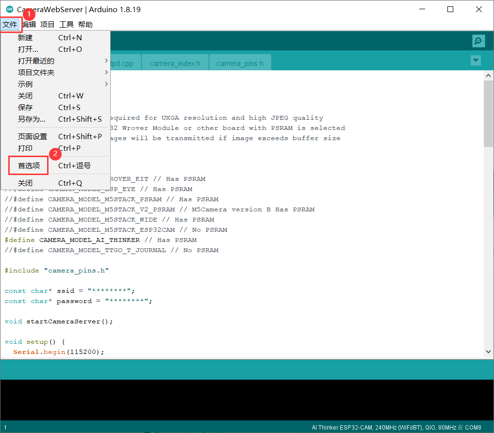

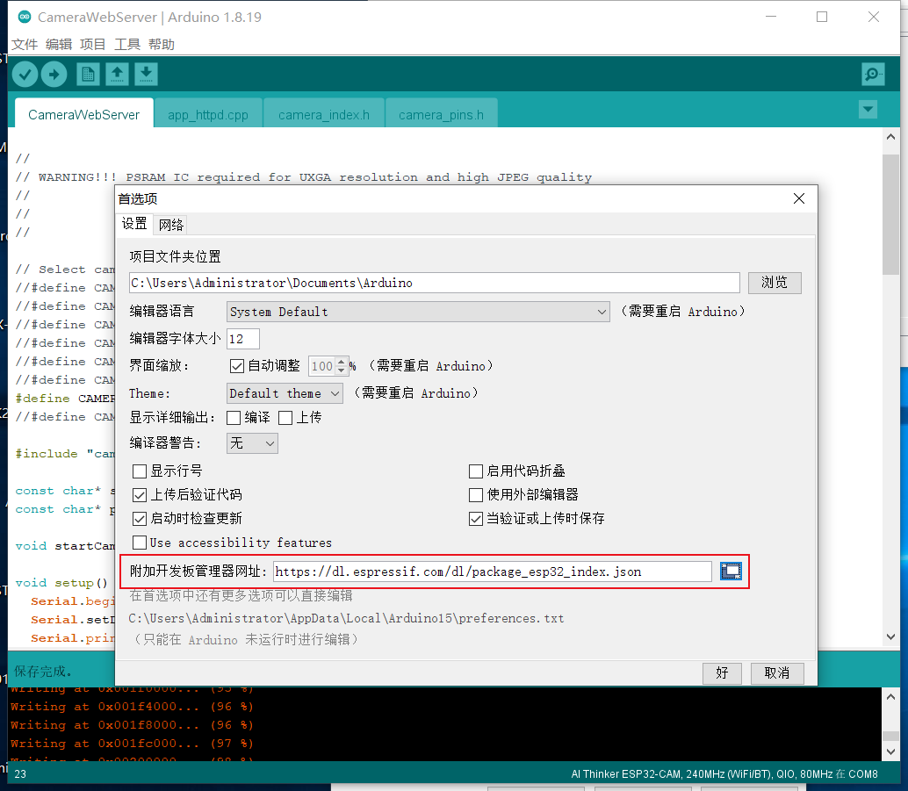

```
https://dl.espressif.com/dl/package_esp32_index.json
```

安装工具链：

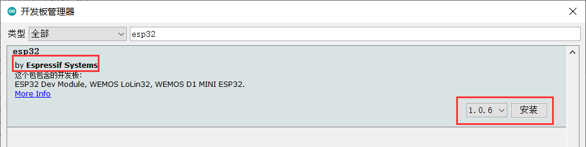

安装完成：

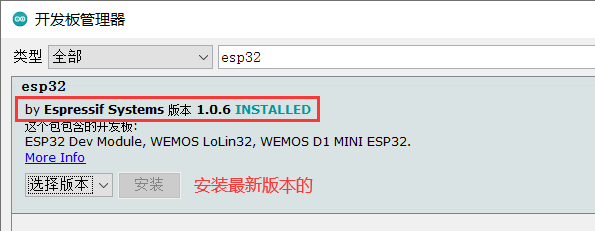

选择开发板：

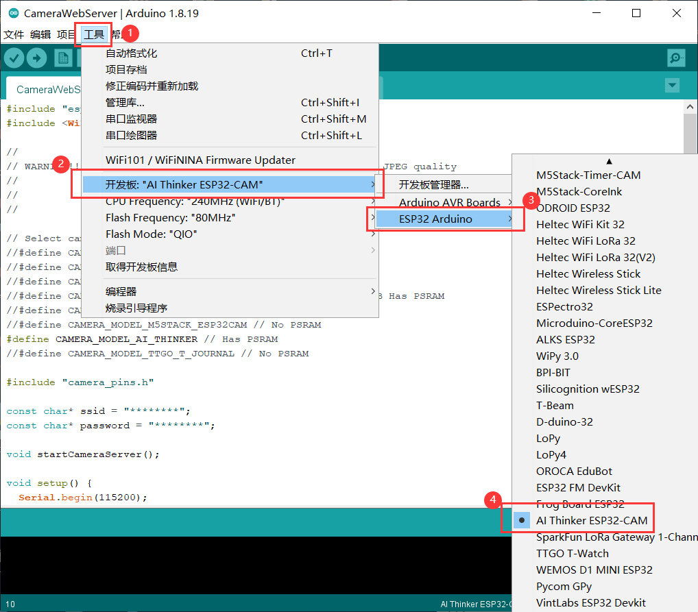

打开摄像头例程：

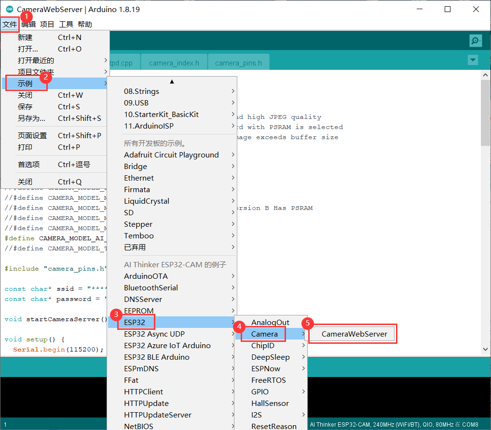

配置开发板型号和 wifi 信息：

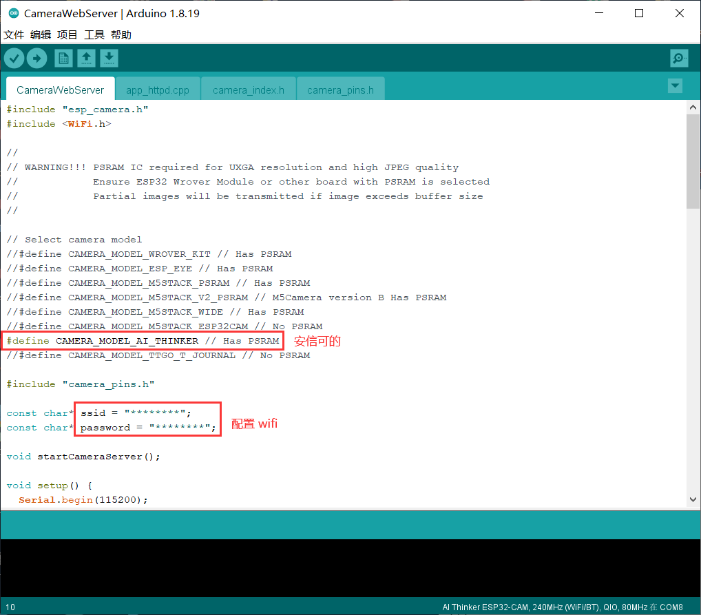

用杜邦线将IO0接地后，给开发板上电，让芯片进入下载模式。

选择端口，编译并烧录程序：

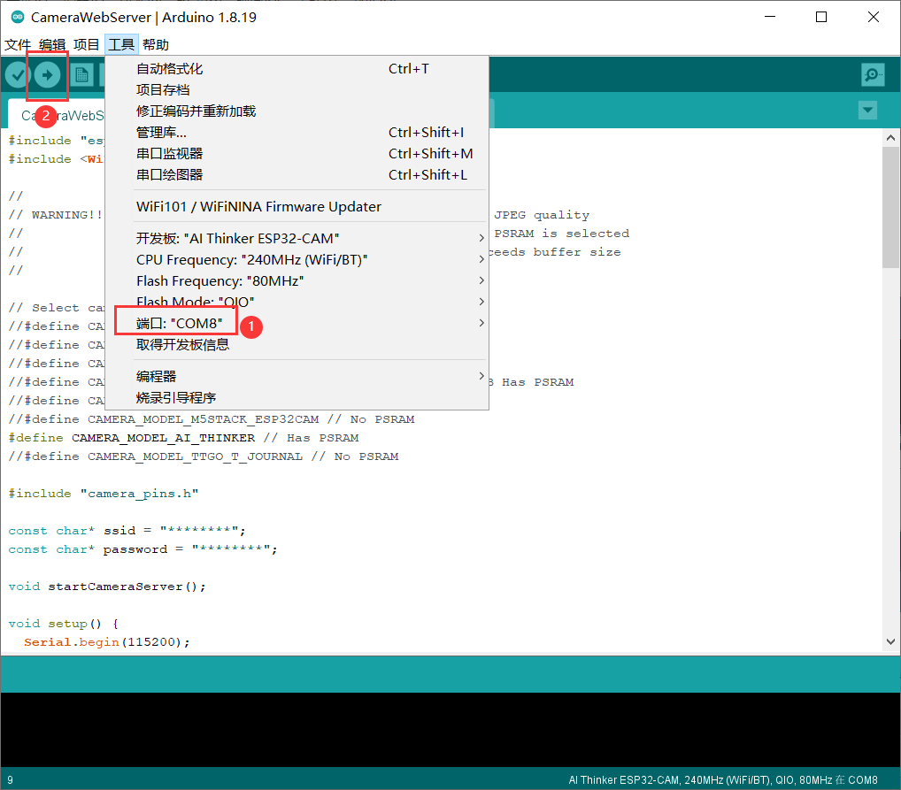

打开串口监视器，设置波特率为 115200：

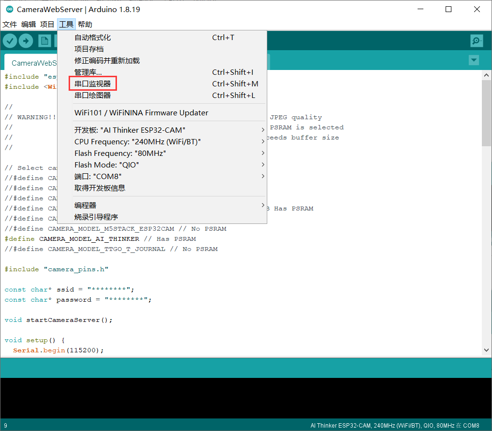

将杜邦线IO0与GND连接的线拔掉，按下板子上的 RST 键，进入程序运行模式，会输出以下内容：

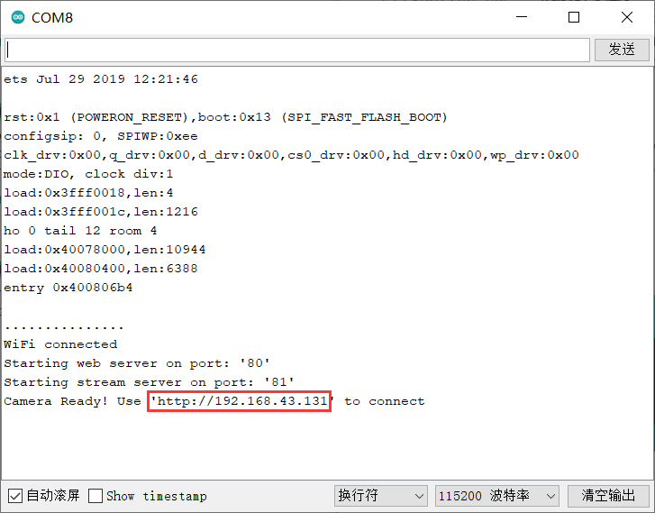

在浏览器中打开输出的 IP 地址（IP地址不固定，具体查看自己的输出信息）


点击web页面里的开始按钮，即可显示：

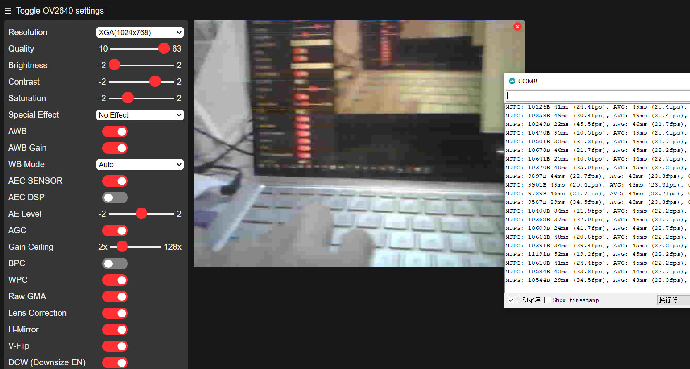

---

我使用的是手机热点（2.4G频段），局域网传输，不耗流量，传输速度也快，非常 nice！

！！esp32 的 wifi 不支持 5G 频段

