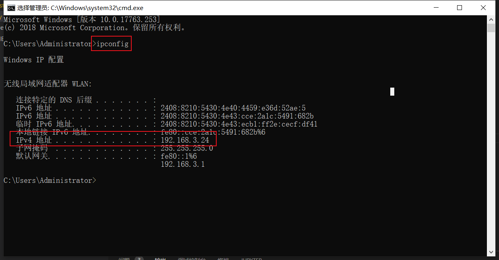

srcfrom: https://doc.itprojects.cn/0006.zhishi.esp32/02.doc/index.html#/e03.showvideo

获取本机 IP（因为是局域网传输，所以单片机需和电脑连接同一个 WiFi）:

#### PC 端

用于查看和保存视频流

`app_mini_server.py`：最简传输
`app_full_server.py`：带 UI 界面（PySide6）
